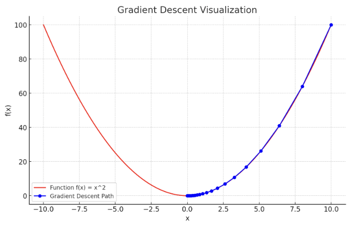

# Gradient Descent Visualization

## Description
This project demonstrates the gradient descent algorithm, a fundamental technique in optimization and machine learning. It visualizes the process of minimizing the function `f(x) = x^2` using gradient descent. The script dynamically shows how the algorithm approaches the minimum of the function step by step.

## Features
- Visualization of the gradient descent algorithm in action.
- Configurable parameters for the algorithm such as the starting point, learning rate, and number of iterations.
- Interactive plot showing the path taken by the algorithm to reach the minimum.

## Installation
To run this project, you need Python and the following Python libraries:
- NumPy
- Matplotlib

You can install these dependencies using pip:
```
pip install numpy matplotlib
```


## Usage
To run the script, navigate to the project directory in your terminal and execute the following command:

```
python GradientDescentVisalization.py [start_point] [learning_rate] [n_iterations]
```
Example:
```
python GradientDescentVisalization.py 10 0.1 50
```

</img>

The plot above visualizes the gradient descent process for the function `f(x)=x^2` with the starting point at `x = 10` a learning rate of 0.1, and running for 50 iterations. 
The blue dots and line represent the path taken by the gradient descent algorithm as it moves towards the minimum of the function. ​
